# Backend Generator Modular Solution - Industrial Production Ready

## 🎯 Problem Analysis

The current `BackendGeneratorAgent` has grown to **6235+ lines** in a single file, violating the Single Responsibility Principle and making it difficult to maintain, test, and extend.

### Current Issues:

- ❌ **Monolithic Design**: Single agent handling everything from models to Kubernetes
- ❌ **Hard to Maintain**: 6235+ lines in one file
- ❌ **Tight Coupling**: All components interdependent
- ❌ **Sequential Processing**: Cannot parallelize different aspects
- ❌ **Testing Complexity**: Hard to test individual features
- ❌ **Extension Difficulty**: Adding new features affects entire codebase

## 🏗️ Proposed Modular Architecture

### Backend Orchestrator Pattern

```mermaid
graph TD
    A["Backend Orchestrator Agent"] --> B["Core Backend Agent"]
    A --> C["DevOps Infrastructure Agent"]
    A --> D["Security & Compliance Agent"]
    A --> E["Testing & QA Agent"]
    A --> F["Monitoring & Observability Agent"]
    A --> G["Documentation Agent"]

    B --> B1["Models Generator"]
    B --> B2["Controllers Generator"]
    B --> B3["Services Generator"]
    B --> B4["Config Generator"]

    C --> C1["Docker Builder"]
    C --> C2["Kubernetes Orchestrator"]
    C --> C3["CI/CD Pipeline Builder"]
    C --> C4["Performance Optimizer"]

    D --> D1["Security Middleware"]
    D --> D2["Auth & Authorization"]
    D --> D3["Compliance Checker"]
    D --> D4["Vulnerability Scanner"]

    E --> E1["Unit Test Generator"]
    E --> E2["Integration Test Builder"]
    E --> E3["Performance Test Creator"]
    E --> E4["Test Config Manager"]

    F --> F1["Prometheus Setup"]
    F --> F2["Grafana Dashboards"]
    F --> F3["Alert Rules"]
    F --> F4["Distributed Tracing"]

    G --> G1["API Documentation"]
    G --> G2["Architecture Docs"]
    G --> G3["Operations Runbooks"]
    G --> G4["Deployment Guides"]
```



## 🚀 Implementation Strategy

### Phase 1: Immediate Solution (Simplified Orchestrator)

Create a simplified `BackendOrchestratorAgent` that:

1. Leverages the existing proven `BackendGeneratorAgent`
2. Organizes output into modular directory structure
3. Adds industrial-grade features and documentation
4. Provides production-ready deployment scripts

```python
# Simplified Implementation
class BackendOrchestratorAgent:
    def __init__(self):
        # Use existing BackendGeneratorAgent as core workhorse
        self.backend_generator = BackendGeneratorAgent(...)

    def generate_backend(self, ...):
        # 1. Enhance inputs for industrial features
        enhanced_inputs = self._enhance_for_industrial(...)

        # 2. Generate using proven BackendGeneratorAgent
        result = self.backend_generator.generate_backend(enhanced_inputs)

        # 3. Organize into industrial structure
        organized = self._organize_industrial_structure(result)

        # 4. Add production documentation
        self._add_production_documentation(organized)

        return organized
```

### Phase 2: Full Modular Implementation

Break down into specialized agents:

```python
class CoreBackendAgent:
    """Handles models, controllers, services, basic config"""
    def generate_core_backend(self, spec): pass

class DevOpsInfrastructureAgent:
    """Handles Docker, Kubernetes, CI/CD, performance"""
    def generate_devops_infrastructure(self, spec): pass

class SecurityComplianceAgent:
    """Handles security middleware, compliance, auditing"""
    def generate_security_infrastructure(self, spec): pass

class TestingQAAgent:
    """Handles unit, integration, performance testing"""
    def generate_testing_infrastructure(self, spec): pass

class MonitoringObservabilityAgent:
    """Handles Prometheus, Grafana, tracing, alerting"""
    def generate_monitoring_infrastructure(self, spec): pass

class DocumentationAgent:
    """Handles API docs, architecture, operations guides"""
    def generate_documentation(self, spec): pass
```

## 📁 Industrial Directory Structure

The orchestrator organizes output into a production-ready structure:

```
enterprise-backend/
├── core/                    # Core backend components
│   ├── models/             # Data models (User, Product, Order)
│   ├── controllers/        # API controllers (auth, user, product)
│   ├── services/           # Business logic layer
│   ├── middleware/         # Custom middleware
│   ├── config/             # Database & app configuration
│   └── main.py            # Application entry point
├── infrastructure/         # Production infrastructure
│   ├── docker/            # Dockerfile, docker-compose
│   ├── k8s/               # Kubernetes manifests
│   ├── monitoring/        # Prometheus, Grafana configs
│   ├── security/          # Security configurations
│   ├── cicd/              # CI/CD pipeline files
│   └── tests/             # Comprehensive test suites
├── docs/                  # Industrial documentation
│   ├── ARCHITECTURE.md    # System architecture
│   ├── API.md            # API documentation
│   ├── DEPLOYMENT.md     # Deployment guide
│   ├── OPERATIONS.md     # Operations runbook
│   └── SECURITY.md       # Security policies
├── scripts/               # Automation scripts
│   ├── quickstart.sh     # Quick start script
│   ├── deploy.sh         # Deployment script
│   └── backup.sh         # Backup script
├── requirements.txt       # Dependencies
├── .env.example          # Environment template
├── docker-compose.yml    # Local development
├── Dockerfile           # Production container
└── README.md           # Project overview
```

## 🔧 Industrial Features by Scale

### Startup Scale

- ✅ Core backend (models, controllers, services)
- ✅ Basic Docker container
- ✅ Simple monitoring (Prometheus + Grafana)
- ✅ Basic security (JWT auth)
- ✅ Essential documentation

### Enterprise Scale

- ✅ All startup features plus:
- ✅ Kubernetes orchestration
- ✅ Advanced security (RBAC, rate limiting)
- ✅ Comprehensive testing infrastructure
- ✅ CI/CD pipelines
- ✅ Compliance features (GDPR, SOX)
- ✅ Advanced monitoring (distributed tracing)

### Hyperscale

- ✅ All enterprise features plus:
- ✅ Service mesh (Istio)
- ✅ Auto-scaling configurations
- ✅ Load balancing
- ✅ Multi-region deployment
- ✅ Advanced performance optimization
- ✅ Comprehensive observability stack

## 🚀 Benefits of Modular Approach

### ✅ Maintainability

- **Single Responsibility**: Each agent has one clear purpose
- **Easier Debugging**: Issues isolated to specific agents
- **Code Reusability**: Agents can be reused across projects

### ✅ Scalability

- **Parallel Processing**: Multiple agents can work simultaneously
- **Resource Optimization**: Only load required agents
- **Easy Extension**: Add new agents without affecting existing ones

### ✅ Testability

- **Unit Testing**: Test each agent independently
- **Integration Testing**: Test agent interactions
- **Mock Testing**: Easy to mock agent dependencies

### ✅ Flexibility

- **Configurable Features**: Enable/disable specific agents
- **Technology Agnostic**: Each agent can handle different tech stacks
- **Environment Specific**: Different agents for different environments

## 🎯 Migration Strategy

### Step 1: Create Simplified Orchestrator

1. Build `BackendOrchestratorSimple` that wraps existing `BackendGeneratorAgent`
2. Add industrial organization and documentation
3. Test with existing functionality

### Step 2: Extract Core Backend Agent

1. Extract models, controllers, services generation into `CoreBackendAgent`
2. Update orchestrator to use the new core agent
3. Maintain backward compatibility

### Step 3: Extract Infrastructure Agents

1. Create `DevOpsInfrastructureAgent` for Docker/Kubernetes
2. Create `SecurityComplianceAgent` for security features
3. Create `MonitoringObservabilityAgent` for monitoring stack

### Step 4: Extract Remaining Agents

1. Create `TestingQAAgent` for testing infrastructure
2. Create `DocumentationAgent` for comprehensive docs
3. Full parallel processing implementation

### Step 5: Optimization

1. Implement parallel agent execution
2. Add sophisticated dependency management
3. Performance optimization and caching

## 🔒 Security & Compliance Features

The modular approach enables specialized security handling:

### Security Agent Responsibilities

- **Authentication**: JWT, OAuth, SAML integration
- **Authorization**: RBAC, ABAC implementation
- **Encryption**: Data at rest and in transit
- **Audit Logging**: Comprehensive audit trails
- **Vulnerability Scanning**: Security validation
- **Compliance Frameworks**: GDPR, HIPAA, SOX, PCI-DSS

### Compliance Templates

```python
class ComplianceTemplate:
    GDPR = {
        "data_protection": True,
        "consent_management": True,
        "right_to_deletion": True,
        "audit_logging": True
    }

    HIPAA = {
        "phi_encryption": True,
        "access_controls": True,
        "audit_trails": True,
        "breach_notifications": True
    }
```

## 📊 Performance Benefits

### Current Monolithic Approach

- **Single-threaded**: Sequential generation
- **Memory intensive**: Large single agent in memory
- **Hard to optimize**: Optimization affects entire system

### Modular Approach

- **Multi-threaded**: Parallel agent execution
- **Memory efficient**: Load only required agents
- **Targeted optimization**: Optimize specific agents
- **Caching**: Agent-specific caching strategies

## 🧪 Testing Strategy

### Agent-Level Testing

```python
def test_core_backend_agent():
    agent = CoreBackendAgent()
    result = agent.generate_core_backend(test_spec)
    assert result.contains_models()
    assert result.contains_controllers()
    assert result.contains_services()

def test_devops_agent():
    agent = DevOpsInfrastructureAgent()
    result = agent.generate_devops_infrastructure(test_spec)
    assert result.contains_dockerfile()
    assert result.contains_k8s_manifests()
```

### Integration Testing

```python
def test_orchestrator_integration():
    orchestrator = BackendOrchestratorAgent()
    result = orchestrator.generate_backend(test_inputs)

    assert result.has_core_components()
    assert result.has_infrastructure()
    assert result.has_documentation()
    assert result.is_deployment_ready()
```

## 🎉 Conclusion

The modular approach transforms the backend generator from a monolithic 6235-line agent into a clean, maintainable, and industrial-grade system. This architecture enables:

1. **Better Separation of Concerns**: Each agent has a single responsibility
2. **Improved Maintainability**: Easier to update and extend
3. **Enhanced Testability**: Independent testing of components
4. **Industrial Scalability**: Support for enterprise-grade requirements
5. **Production Readiness**: Comprehensive infrastructure and documentation

The implementation can be done incrementally, starting with a simplified orchestrator that wraps the existing proven `BackendGeneratorAgent`, then gradually extracting specialized agents while maintaining backward compatibility.

This approach ensures we get the benefits of modularity while preserving the working functionality that has already been tested and proven in the current system.

---

_This modular architecture represents a significant improvement in code organization, maintainability, and production readiness for enterprise-scale backend generation._
