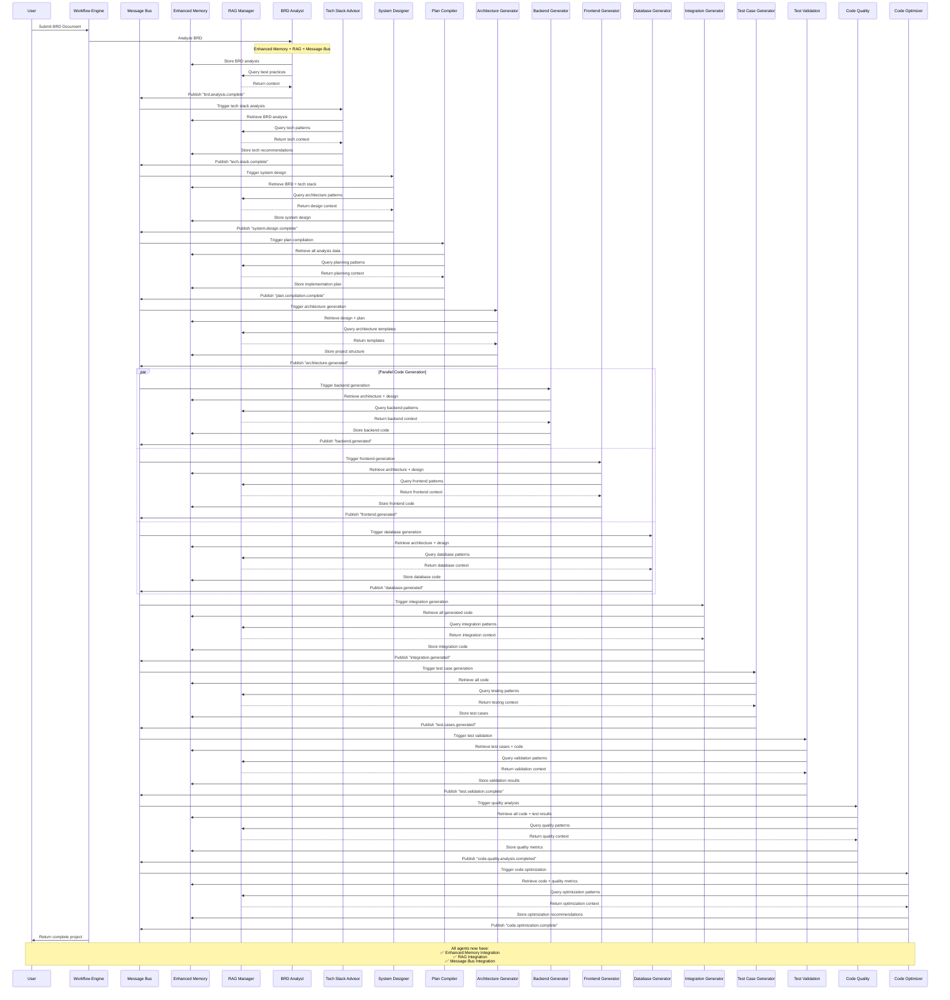

# Agent Integration Message Flow Diagram

This diagram shows the complete flow of messages and data between all agents in the enhanced multi-AI development system.

```mermaid
sequenceDiagram
    participant User
    participant WF as Workflow Engine
    participant MB as Message Bus
    participant EM as Enhanced Memory
    participant RAG as RAG Manager

    participant BRD as BRD Analyst
    participant TSA as Tech Stack Advisor
    participant SD as System Designer
    participant PC as Plan Compiler
    participant AG as Architecture Generator
    participant BG as Backend Generator
    participant FG as Frontend Generator
    participant DG as Database Generator
    participant IG as Integration Generator
    participant TCG as Test Case Generator
    participant TV as Test Validation
    participant CQ as Code Quality
    participant CO as Code Optimizer

    User->>WF: Submit BRD Document
    WF->>BRD: Analyze BRD

    Note over BRD: Enhanced Memory + RAG + Message Bus
    BRD->>EM: Store BRD analysis
    BRD->>RAG: Query best practices
    RAG-->>BRD: Return context
    BRD->>MB: Publish "brd.analysis.complete"

    MB->>TSA: Trigger tech stack analysis
    TSA->>EM: Retrieve BRD analysis
    TSA->>RAG: Query tech patterns
    RAG-->>TSA: Return tech context
    TSA->>EM: Store tech recommendations
    TSA->>MB: Publish "tech.stack.complete"

    MB->>SD: Trigger system design
    SD->>EM: Retrieve BRD + tech stack
    SD->>RAG: Query architecture patterns
    RAG-->>SD: Return design context
    SD->>EM: Store system design
    SD->>MB: Publish "system.design.complete"

    MB->>PC: Trigger plan compilation
    PC->>EM: Retrieve all analysis data
    PC->>RAG: Query planning patterns
    RAG-->>PC: Return planning context
    PC->>EM: Store implementation plan
    PC->>MB: Publish "plan.compilation.complete"

    MB->>AG: Trigger architecture generation
    AG->>EM: Retrieve design + plan
    AG->>RAG: Query architecture templates
    RAG-->>AG: Return templates
    AG->>EM: Store project structure
    AG->>MB: Publish "architecture.generated"

    par Parallel Code Generation
        MB->>BG: Trigger backend generation
        BG->>EM: Retrieve architecture + design
        BG->>RAG: Query backend patterns
        RAG-->>BG: Return backend context
        BG->>EM: Store backend code
        BG->>MB: Publish "backend.generated"
    and
        MB->>FG: Trigger frontend generation
        FG->>EM: Retrieve architecture + design
        FG->>RAG: Query frontend patterns
        RAG-->>FG: Return frontend context
        FG->>EM: Store frontend code
        FG->>MB: Publish "frontend.generated"
    and
        MB->>DG: Trigger database generation
        DG->>EM: Retrieve architecture + design
        DG->>RAG: Query database patterns
        RAG-->>DG: Return database context
        DG->>EM: Store database code
        DG->>MB: Publish "database.generated"
    end

    MB->>IG: Trigger integration generation
    IG->>EM: Retrieve all generated code
    IG->>RAG: Query integration patterns
    RAG-->>IG: Return integration context
    IG->>EM: Store integration code
    IG->>MB: Publish "integration.generated"

    MB->>TCG: Trigger test case generation
    TCG->>EM: Retrieve all code
    TCG->>RAG: Query testing patterns
    RAG-->>TCG: Return testing context
    TCG->>EM: Store test cases
    TCG->>MB: Publish "test.cases.generated"

    MB->>TV: Trigger test validation
    TV->>EM: Retrieve test cases + code
    TV->>RAG: Query validation patterns
    RAG-->>TV: Return validation context
    TV->>EM: Store validation results
    TV->>MB: Publish "test.validation.complete"

    MB->>CQ: Trigger quality analysis
    CQ->>EM: Retrieve all code + test results
    CQ->>RAG: Query quality patterns
    RAG-->>CQ: Return quality context
    CQ->>EM: Store quality metrics
    CQ->>MB: Publish "code.quality.analysis.completed"

    MB->>CO: Trigger code optimization
    CO->>EM: Retrieve code + quality metrics
    CO->>RAG: Query optimization patterns
    RAG-->>CO: Return optimization context
    CO->>EM: Store optimization recommendations
    CO->>MB: Publish "code.optimization.complete"

    WF->>User: Return complete project

    Note over User,CO: All agents now have:<br/>✅ Enhanced Memory Integration<br/>✅ RAG Integration<br/>✅ Message Bus Integration
```
