# System Architecture Diagram

This diagram shows the overall architecture of the enhanced multi-AI development system with all integration components.

```mermaid
graph TB
    subgraph "Enhanced Multi-AI Development System"
        subgraph "Core Infrastructure"
            EM[Enhanced Memory Manager]
            RAG[RAG Manager]
            MB[Message Bus]
            SM[Shared Memory]
        end

        subgraph "Phase 1: Priority React Agents"
            BRD[BRD Analyst ReAct]
            TSA[Tech Stack Advisor ReAct]
            SD[System Designer ReAct]
            PC[Plan Compiler ReAct]
        end

        subgraph "Phase 2: React-Only Agents"
            ERB[Enhanced ReAct Base]
            AG[Architecture Generator]
            FG[Frontend Generator]
            IG[Integration Generator]
        end

        subgraph "Phase 3: Single-Version Agents"
            CQ[Code Quality Agent]
            TCG[Test Case Generator]
            TV[Test Validation]
            BCG[Base Code Generator]
            BG[Backend Generator]
            DG[Database Generator]
            CO[Code Optimizer]
        end

        subgraph "Phase 4: Planning Agents"
            RA[Risk Assessor]
            PA[Project Analyzer]
            TE[Timeline Estimator]
        end

        subgraph "Integration Points"
            API[API Layer]
            WF[Workflow Engine]
            MON[Monitoring System]
        end
    end

    %% Enhanced Memory Connections
    EM -.->|"Cross-tool data storage"| BRD
    EM -.->|"Cross-tool data storage"| TSA
    EM -.->|"Cross-tool data storage"| SD
    EM -.->|"Cross-tool data storage"| PC
    EM -.->|"Cross-tool data storage"| AG
    EM -.->|"Cross-tool data storage"| FG
    EM -.->|"Cross-tool data storage"| IG
    EM -.->|"Cross-tool data storage"| CQ
    EM -.->|"Cross-tool data storage"| TCG
    EM -.->|"Cross-tool data storage"| TV
    EM -.->|"Cross-tool data storage"| BCG
    EM -.->|"Cross-tool data storage"| BG
    EM -.->|"Cross-tool data storage"| DG
    EM -.->|"Cross-tool data storage"| CO
    EM -.->|"Cross-tool data storage"| RA
    EM -.->|"Cross-tool data storage"| PA
    EM -.->|"Cross-tool data storage"| TE

    %% RAG Connections
    RAG -.->|"Context retrieval"| BRD
    RAG -.->|"Context retrieval"| TSA
    RAG -.->|"Context retrieval"| SD
    RAG -.->|"Context retrieval"| PC
    RAG -.->|"Context retrieval"| AG
    RAG -.->|"Context retrieval"| FG
    RAG -.->|"Context retrieval"| IG
    RAG -.->|"Context retrieval"| CQ
    RAG -.->|"Context retrieval"| TCG
    RAG -.->|"Context retrieval"| TV
    RAG -.->|"Context retrieval"| BCG
    RAG -.->|"Context retrieval"| BG
    RAG -.->|"Context retrieval"| DG
    RAG -.->|"Context retrieval"| CO
    RAG -.->|"Context retrieval"| RA
    RAG -.->|"Context retrieval"| PA
    RAG -.->|"Context retrieval"| TE

    %% Message Bus Connections
    MB -->|"Event publishing"| BRD
    MB -->|"Event publishing"| TSA
    MB -->|"Event publishing"| SD
    MB -->|"Event publishing"| PC
    MB -->|"Event publishing"| AG
    MB -->|"Event publishing"| FG
    MB -->|"Event publishing"| IG
    MB -->|"Event publishing"| CQ
    MB -->|"Event publishing"| TCG
    MB -->|"Event publishing"| TV
    MB -->|"Event publishing"| BCG
    MB -->|"Event publishing"| BG
    MB -->|"Event publishing"| DG
    MB -->|"Event publishing"| CO
    MB -->|"Event publishing"| RA
    MB -->|"Event publishing"| PA
    MB -->|"Event publishing"| TE

    %% Workflow Dependencies
    BRD -->|"BRD Analysis"| TSA
    TSA -->|"Tech Stack"| SD
    SD -->|"System Design"| PA
    PA -->|"Project Analysis"| TE
    TE -->|"Timeline"| RA
    RA -->|"Risk Assessment"| PC
    PC -->|"Implementation Plan"| AG
    AG -->|"Architecture"| BG
    AG -->|"Architecture"| FG
    AG -->|"Architecture"| DG
    BG -->|"Backend Code"| IG
    FG -->|"Frontend Code"| IG
    DG -->|"Database Code"| IG
    IG -->|"Integration Code"| TCG
    TCG -->|"Test Cases"| TV
    TV -->|"Validation Results"| CQ
    CQ -->|"Quality Report"| CO

    %% Infrastructure Connections
    WF -->|"Orchestrates"| BRD
    API -->|"External Access"| WF
    MON -->|"Monitors"| MB

    %% Styling
    classDef coreInfra fill:#e1f5fe,stroke:#01579b,stroke-width:2px
    classDef phase1 fill:#f3e5f5,stroke:#4a148c,stroke-width:2px
    classDef phase2 fill:#e8f5e8,stroke:#1b5e20,stroke-width:2px
    classDef phase3 fill:#fff3e0,stroke:#e65100,stroke-width:2px
    classDef phase4 fill:#fce4ec,stroke:#880e4f,stroke-width:2px
    classDef integration fill:#f1f8e9,stroke:#33691e,stroke-width:2px

    class EM,RAG,MB,SM coreInfra
    class BRD,TSA,SD,PC phase1
    class ERB,AG,FG,IG phase2
    class CQ,TCG,TV,BCG,BG,DG,CO phase3
    class RA,PA,TE phase4
    class API,WF,MON integration
```

## How to View This Diagram

1. **In VS Code**: Install the "Markdown Preview Mermaid Support" extension
2. **In GitHub**: Upload this file to a GitHub repo and view it
3. **Online**: Copy the content and paste it into https://mermaid.live/
4. **Obsidian**: If you use Obsidian, it has native Mermaid support
