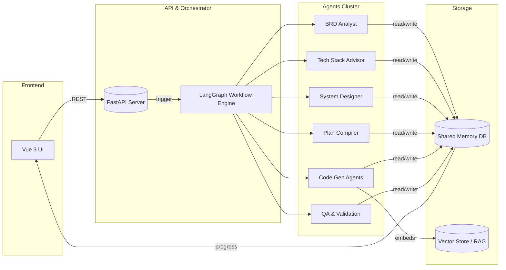
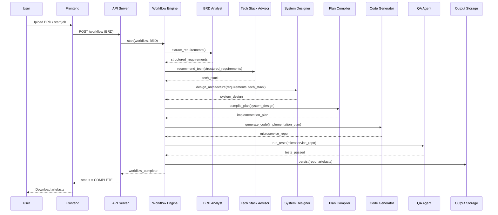

# Multi-AI Agent Software Engineering Automation System

> **Project Codename:** `multi-ai-dev-system`

---

## 1. Description

`multi-ai-dev-system` is a production-ready, end-to-end automation platform that transforms high-level Business Requirement Documents (BRDs) into deployable, tested, and documented micro-service code bases. It orchestrates a **pipeline of temperature-optimised AI agents** through a LangGraph workflow, enriched with Retrieval-Augmented Generation (RAG), advanced memory, and real-time monitoring utilities. The system drastically reduces the software development life-cycle by automating:

* Requirement extraction and validation  
* Architectural & technology-stack design  
* Detailed planning & task decomposition  
* Deterministic code, test, and documentation generation  
* Quality assurance, optimisation, and deployment artefact creation  
* Continuous monitoring, error recovery, and checkpoint-based resumption

---

## 2. Major Components

| Layer | Key Modules / Paths | Responsibilities |
|-------|---------------------|------------------|
| **Agents** | `agents/` (e.g. `brd_analyst_react.py`, `code_generation/`, `planning/`) | Specialised LLM agents, each bound to a temperature suited for their cognitive task (analysis, planning, code generation, validation…). |
| **Workflow & Orchestration** | `graph.py`, `langgraph_enhanced_a2a.py`, `enhanced_workflow_integration.py` | Defines LangGraph nodes & edges, enhanced agent-to-agent (A2A) communication, resumable checkpoints, and error-recovery logic. |
| **Tools** | `tools/` (e.g. `code_execution_tool.py`, `code_generation_utils.py`, `rag_manager.py`) | Deterministic helpers exposed to agents for code execution, RAG retrieval, parsing, validation, etc. |
| **Memory & Cache** | `shared_memory.py`, `llm_cache.py`, `output/**/memory.db` | Persistent vector & relational stores for agent context, checkpoints, and RAG embeddings. |
| **Rate Limiting & Tracking** | `advanced_rate_limiting/`, `monitoring.py`, `performance_monitor.py` | Tracks token usage & latencies, enforces per-model/agent limits, and emits metrics. |
| **API & Serving Layer** | `app/server.py`, `serve.py`, `app/middleware.py`, `frontend/` | REST API + Vue-3 UI for job submission, status streaming, and workflow visualisation. |
| **Infrastructure & DevOps** | `output/**/kubernetes/`, `Dockerfile`, `scripts/*.sh` | Auto-generated deploy manifests, container specs, and helper scripts. |

---

### 2.1 Agent Catalogue

Below is a comprehensive list of all agent classes grouped by their primary responsibility. *(File names refer to paths under `multi-ai-dev-system/agents/`.)*

**A. Planning & Analysis**

- **BRDAnalystAgent / BRDAnalystReActAgent** – `brd_analyst.py`, `brd_analyst_react.py`
- **TechStackAdvisorAgent / TechStackAdvisorReActAgent** – `tech_stack_advisor.py`, `tech_stack_advisor_react.py`
- **SystemDesignerAgent / SystemDesignerReActAgent** – `system_designer.py`, `system_designer_react.py`
- **PlanCompilerAgent / PlanCompilerReActAgent** – `planning/plan_compiler.py`, `planning/plan_compiler_react.py`
- **ProjectAnalyzerAgent** – `planning/project_analyzer.py`
- **TimelineEstimatorAgent** – `planning/timeline_estimator.py`
- **RiskAssessorAgent** – `planning/risk_assessor.py`

**B. Core Code Generation**

- **ArchitectureGeneratorAgent** – `code_generation/architecture_generator.py`
- **DatabaseGeneratorAgent** – `code_generation/database_generator.py`
- **BackendOrchestratorAgent** – `code_generation/backend_orchestrator.py`
- **FrontendGeneratorAgent** – `code_generation/frontend_generator.py`
- **IntegrationGeneratorAgent** – `code_generation/integration_generator.py`
- **CodeOptimizerAgent** – `code_generation/code_optimizer.py`

**C. Specialized Code Generation** (`code_generation/specialized/`)

- **CoreBackendAgent** – `core_backend_agent.py`
- **DevOpsInfrastructureAgent** – `devops_infrastructure_agent.py`
- **DocumentationAgent** – `documentation_agent.py`
- **MonitoringObservabilityAgent** – `monitoring_observability_agent.py`
- **SecurityComplianceAgent** – `security_compliance_agent.py`
- **TestingQAAgent** – `testing_qa_agent.py`

**D. Quality Assurance & Testing**

- **CodeQualityAgent** – `code_quality_agent.py`
- **TestCaseGeneratorAgent** – `test_case_generator.py`
- **TestValidationAgent** – `test_validation_agent.py`

**E. Foundations & Mix-ins**

- **BaseAgent** – `base_agent.py` (abstract helper for all agents)
- **EnhancedReActBase** – `enhanced_react_base.py` (mix-in providing ReAct + tool-calling utilities)

> This catalogue is kept up to date with the `agents/` directory and should be revised whenever new agents are introduced or deprecated.

---

## 3. End-to-End Pipeline Flow

1. **BRD Ingestion** – A document (PDF/DOCX/TXT/MD) is supplied via CLI or API.  
2. **Requirement Extraction** – `BRD Analyst Agent` parses functional & non-functional requirements, persisting them to memory.  
3. **Tech-Stack Recommendation** – `Tech Stack Advisor Agent` proposes languages, frameworks, and cloud services.  
4. **System Design** – `System Designer Agent` outputs architecture diagrams, database schema, and service boundaries.  
5. **Planning & Scheduling** – `Plan Compiler Agent` decomposes the build into stories, sprints, and tasks.  
6. **Code Generation** – `Backend / Frontend / Integration Generators` create code, tests, and docs for each micro-service.  
7. **Validation & QA** – `Code Quality` & `Test Validation` agents execute linters and test suites, issuing fixes or retries on failure.  
8. **Deployment Artefacts** – Dockerfiles, Kubernetes YAML, and CI/CD configs are rendered.  
9. **Monitoring & Optimisation** – Runtime metrics are streamed; `system_optimizer.py` may trigger re-generation or scaling advice.  
10. **Delivery** – All artefacts are zipped in `output/` and optionally pushed to a git repository.

---

## 4. Visual Aids

### 4.1 Component Architecture

### 4.2 Pipeline Sequence

---

## 5. How to Extend

* **Add a new agent:** Drop a script in `agents/`, import it in `graph_nodes.py`, and link it in `graph.py` with proper temperature.
* **Swap LLMs:** Update `config.py` / `.env` and ensure rate-limiting settings exist in `advanced_rate_limiting/config.py`.
* **Integrate custom tools:** Place utilities in `tools/`, then reference them in agent prompts via `ToolContext`.

---

## 6. References & Further Reading

* [`README.md`](README.md) – Quick-start & CLI usage  
* [`Documentations/flow.md`](Documentations/flow.md) – Detailed design walk-through  
* [LangGraph Docs](https://langchain-ai.github.io/langgraph/)  
* [Gemini API](https://ai.google.dev/)  

---

© 2025 Multi-AI Dev System – MIT License 